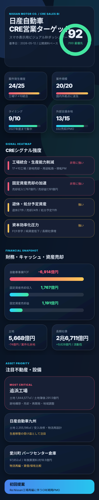

# 日産自動車 CRE営業ターゲット・ダッシュボード

> **基準日：2026-05-12**<br>
> 有価証券報告書・経営計画・統合報告書・直近四半期決算を横断し、CRE（企業不動産）コンサルティングの提案余地を可視化した営業判断用ダッシュボードです。

> **ブラウザ版BIダッシュボード：** [`dashboard/index.html`](./dashboard/index.html)<br>
> 静的HTML/CSSのみで表示できる、営業判断向けのWebダッシュボードを追加しています。

> **スマホのCodex画面でBI表示する場合：** [`MOBILE_VISUAL_DASHBOARD.md`](./MOBILE_VISUAL_DASHBOARD.md)<br>
> ダウンロードやHTTPサーバーなしで見られる、縦長SVGのビジュアルBIダッシュボードを追加しています。


## スマホBI表示版（Codex画面用）

スマホのCodex画面から、テキストではなく**BIツール風のビジュアルダッシュボード**として見る場合は、次のファイルを開いてください。

```text
research/nissan_cre_2026/MOBILE_VISUAL_DASHBOARD.md
```

このファイル内に、スマホ縦画面向けのSVGダッシュボード `mobile_bi_dashboard.svg` を埋め込んでいます。HTMLの起動、HTTPサーバー、ダウンロード、`file://` URLは不要です。



---

## すぐ開く方法（HTTPサーバー不要）

> `file:///workspace/...` はCodex実行環境内のパスです。お使いのPCのブラウザから直接入力しても、そのPCに `/workspace/codex_01` が存在しないため「削除された」ように表示されます。

1. まず、リポジトリ一式をお使いのPCにダウンロードまたはチェックアウトします。
2. ダウンロードしたフォルダの中で、次のファイルをダブルクリックしてください。

```text
research/nissan_cre_2026/OPEN_DASHBOARD.html
```

3. うまく開けない場合は、同じフォルダ内のOS別起動ファイルを実行します。
   - macOS / Linux: `research/nissan_cre_2026/open_dashboard.sh`
   - Windows: `research/nissan_cre_2026/open_dashboard.bat`
4. 直接HTMLを開く場合は、次のファイルをダブルクリックしてください。

```text
research/nissan_cre_2026/dashboard/index.html
```

---

## 0. Executive Snapshot

| 重要KPI | 判定 | ダッシュボード表示 | 営業上の意味 |
|---|---:|---|---|
| **CRE営業ターゲット総合評価** | **92 / 100** | `█████████░` | 最優先ターゲット。工場再編・固定資産売却・FCF改善が同時進行。 |
| **案件発生確度** | **24 / 25** | `██████████` | 車両生産工場を17→10へ統合する方針が明示され、複数拠点で具体化。 |
| **案件規模** | **20 / 20** | `██████████` | 国内外の工場、研究開発、物流、本社、リース関連資産まで対象が広い。 |
| **タイミング** | **9 / 10** | `█████████░` | 2026年度黒字化、2027年度までの工場統合で短中期案件が集中。 |
| **外部支援余地** | **13 / 15** | `█████████░` | 売却、用途転換、環境DD、自治体調整、移転PMなど専門支援余地が大きい。 |

### 結論

**日産自動車は、CREコンサルティングの営業先として「最優先でアプローチすべき企業」と評価します。**<br>
理由は、Re:Nissanに基づく生産拠点統合、固定資産売却益の急増、遊休・売却・処分予定資産の顕在化、FCF赤字によるキャッシュ創出ニーズが同時に確認できるためです。

---

## 1. 最新資料トラッカー

| 資料カテゴリ | 最新採用資料 | 対象期間・公表日 | 重要度 | CRE分析での使い方 | URL |
|---|---|---:|:---:|---|---|
| 有価証券報告書 | 有価証券報告書 第126期 | 2024-04-01〜2025-03-31 / 2025-06-23提出 | 高 | 設備、土地、借用設備、減損、処分予定資産を確認。 | https://disclosure2dl.edinet-fsa.go.jp/searchdocument/pdf/S100W2UQ.pdf |
| 経営計画 | Re:Nissan / The Arc | The Arc: 2024-03-25、Re:Nissan: 2025-05-13以降更新 | 高 | 工場統合、固定費削減、生産能力再編の方向性を確認。 | https://www2.nissan-global.com/JP/COMPANY/PLAN/RENISSAN/ / https://www.nissan-global.com/JP/NEWS/ASSETS/PDF/240325-02-j_presentation.pdf |
| 統合報告書 | Integrated Report 2024 | 2024年版 | 中 | 長期戦略、資本配分、サステナビリティ、事業ポートフォリオの文脈を確認。 | https://www.nissan-global.com/EN/IR/INTEGRATED_REPORT/ |
| 直近財務データ | 2026年3月期 第3四半期決算短信・補足資料 | 2025-04-01〜2025-12-31 / 2026-02-12公表 | 高 | B/S、FCF、固定資産売却、減損の直近トレンドを確認。 | https://www.nissan-global.com/EN/IR/FINANCIAL_RESULTS/ASSETS/DATA/2025/20253rd_financialresult_059_e.pdf |

> 注：2026-05-12時点では、2026年3月期の有価証券報告書は通常まだ未提出のため、直近通期の法定開示として第126期有価証券報告書を採用しています。

---

## 2. CREシグナル・ヒートマップ

| シグナル | 強度 | 兆候 | 想定されるCRE案件 |
|---|:---:|---|---|
| 工場統合・生産能力削減 | 🔴 非常に強い | 2027年度までに車両生産工場を17→10へ統合。生産能力は年間250万台へ削減し、需要増に応じ50万台の上方弾力性を確保。 | 工場跡地売却、用途転換、移転PM、受入拠点改修、自治体調整。 |
| 具体拠点の再編 | 🔴 非常に強い | 追浜工場の車両生産を2027年度末に終了し日産自動車九州へ移管・統合、シバック工場をアグアスカリエンテス工場へ統合、ロスリンの土地・建物・関連資産を譲渡予定。 | 大規模用地売却、海外資産売却、工場閉鎖DD、土壌・環境調査。 |
| 固定資産売却の加速 | 🔴 非常に強い | FY2025 3Q累計で固定資産売却収入1,766.59億円、固定資産売却益1,191.27億円。 | 資産売却PMO、入札設計、価格査定、買主探索、sale and leaseback検討。 |
| 遊休・処分予定資産 | 🟠 強い | FY2024に遊休資産27件、売却資産24件、処分予定資産11件を開示。 | 遊休資産棚卸し、出口戦略、用途転換、再開発可能性調査。 |
| 資本効率化圧力 | 🟠 強い | 自動車事業FCF赤字、純資産低下、長期社債増加。 | 非中核不動産のキャッシュ化、固定費削減、PPE圧縮。 |
| リース・オフバランス | 🟡 中程度 | 日本基準上の借手オペレーティングリース未経過リース料は96.51億円。在外子会社はIFRS16/ASC842の影響あり。 | 賃借/保有比較、物流倉庫・本社・情報システムセンターのコスト最適化。 |

---

## 3. 財務ダッシュボード：B/S・キャッシュ・資産売却

### 3.1 B/S主要指標

| 指標 | 2025-03末 | 2025-12末 | 変化 | CRE示唆 |
|---|---:|---:|---:|---|
| 総資産 | 19兆240億円 | 19兆6,880億円 | +6,640億円 | 販売金融債権・有価証券増などで増加。資産圧縮より流動性確保が先行。 |
| 純資産 | 5兆4,453億円 | 5兆3,240億円 | -1,213億円 | 赤字継続で資本余力が縮小。純資産比率は約28.6%→約27.0%。 |
| 有形固定資産 | 4兆3,321億円 | 4兆6,086億円 | +2,765億円 | 販売金融リース車両の影響も含むが、PPEの重さは継続。 |
| 土地 | 5,742億円 | 5,668億円 | -74億円 | 簿価は小幅減。工場統合により案件化余地は簿価以上に大きい可能性。 |
| 長期社債 | 1兆7,085億円 | 2兆6,711億円 | +9,626億円 | 社債発行で流動性確保。資産売却・sale and leaseback等の代替調達ニーズを示唆。 |

### 3.2 キャッシュ創出・固定資産売却

| 指標 | FY2024 | FY2025 3Q累計 | ダッシュボード判定 | 読み取り |
|---|---:|---:|:---:|---|
| 自動車事業FCF | -2,428億円 | -6,914億円 | 🔴 | CREによるキャッシュ創出・固定費圧縮への圧力が非常に強い。 |
| 固定資産売却収入 | 463億円 | 1,767億円 | 🔴 | 2025年度に固定資産売却が急加速。資産流動化は実行フェーズ。 |
| 固定資産売却益 | 217億円 | 1,191億円 | 🔴 | 売却益が損益にも大きく寄与。非中核資産の売却余地が顕在化。 |
| 減損損失 | 4,949億円 | 806億円 | 🟠 | 事業計画見直しと資産価値見直しが継続。売却前の会計整理が進む可能性。 |

---

## 4. 不動産・設備ポートフォリオの注目ポイント

### 4.1 主要国内拠点

| 拠点 | 土地面積 | 土地簿価 | 総帳簿価額 | CRE観点の注目度 | 想定論点 |
|---|---:|---:|---:|:---:|---|
| 追浜工場（総合研究所含む） | 1,844,577㎡ | 291.5億円 | 1,122.79億円 | 🔴 | 車両生産終了・九州移管に伴う跡地構想、売却、再開発、地域調整。 |
| 日産自動車九州 | 2,355,196㎡ | 298.49億円 | 1,033.85億円 | 🟠 | 生産移管の受け皿として改修・増強・物流再設計の可能性。 |
| 本社事務所 | 10,000㎡ | 64.55億円 | 266.15億円 | 🟡 | 保有/賃借比較、ワークプレイス最適化、資本効率検証。 |

### 4.2 借用設備・リースコスト

| 施設 | 面積 | 月額賃料 | 年換算 | CRE観点の注目度 | 検討テーマ |
|---|---:|---:|---:|:---:|---|
| 厚木 情報システムセンター | 24,624㎡ | 7,867.8万円 | 約9.4億円 | 🟡 | 賃料水準、BCP、データセンター/オフィス機能の最適配置。 |
| 愛川町 パーツセンター倉庫 | 97,852㎡ | 1億5,389.9万円 | 約18.5億円 | 🟠 | 物流網再編、倉庫集約、賃借/保有比較、契約条件見直し。 |

---

## 5. 営業ターゲット評価スコアカード

| 評価軸 | 配点 | 点数 | 達成率 | 可視化 | 根拠 |
|---|---:|---:|---:|---|---|
| 案件発生確度 | 25 | 24 | 96% | `██████████` | 工場統合・生産能力削減が公式に明示され、複数拠点で具体化。 |
| 案件規模 | 20 | 20 | 100% | `██████████` | 国内外の製造拠点、物流、研究開発、本社、販売金融リース車両関連資産まで対象が大規模。 |
| 経営課題との一致 | 20 | 19 | 95% | `█████████░` | FCF赤字、純資産低下、社債増、固定費削減方針とCRE施策の親和性が高い。 |
| 外部支援余地 | 15 | 13 | 87% | `█████████░` | 売却・再開発・自治体調整・環境DD・用途転換・移転PMなど専門性が必要。 |
| タイミング | 10 | 9 | 90% | `█████████░` | 2026年度までの黒字化、2027年度までの工場統合で短中期案件が集中。 |
| 実現難易度調整 | 10 | 7 | 70% | `███████░░░` | 労務・地域経済・サプライチェーン・政治的配慮により意思決定は重い。 |
| **合計** | **100** | **92** | **92%** | `█████████░` | **最優先ターゲット。** |

---

## 6. 支援メニュー別・営業優先順位

| 優先度 | 支援領域 | 提案テーマ | 初回提案での訴求 |
|:---:|---|---|---|
| **S** | 土地売却・資産売却 | 追浜・海外統合拠点・売却資産24件・処分予定資産11件の買主探索、入札設計、価格査定、売却/賃貸比較。 | 短期キャッシュ創出と売却プロセスの透明性確保。 |
| **S** | 用途転換・跡地企画構想 | 工場跡地の物流、研究開発、住宅/商業、産業団地、データセンター、EV/蓄電池関連拠点等への転用可能性調査。 | 地域説明可能性と企業価値最大化の両立。 |
| **S** | 環境・土壌・許認可DD | 長期操業工場の土壌・地下水・アスベスト・PCB・開発許認可リスクの初期診断。 | 売却前リスクの早期把握と価格毀損防止。 |
| **A** | 建設・移転PM | 日産自動車九州等の受入改修、設備移設、工程・コスト管理。 | 生産移管の遅延・コスト超過リスク低減。 |
| **A** | 用地選定・用地取得 | 統合後の重点市場・電動化・部品物流に合わせた最適立地、サプライチェーン再配置。 | 次世代生産・物流ネットワークの競争力強化。 |
| **B+** | リース/オフバランス戦略 | 本社・情報システムセンター・物流倉庫等の賃借/保有比較、sale and leaseback、グローバルリース負債最適化。 | 固定費削減、資本効率、柔軟性の改善。 |

---

## 7. 営業アプローチ・プレイブック

### 7.1 初回提案コンセプト

| 提案名 | 狙い | 成果物イメージ |
|---|---|---|
| **Re:Nissan工場再編に伴うCRE戦略PMO** | 個別売却の仲介ではなく、ポートフォリオ棚卸し、経済性評価、ステークホルダー調整、出口戦略を包括支援する。 | 拠点別CRE診断、売却/賃貸/再開発比較、優先順位マップ、実行ロードマップ、リスク台帳。 |

### 7.2 優先コンタクト先

| 優先順位 | 部門・機能 | 刺さる論点 |
|:---:|---|---|
| 1 | 経営企画 / IR / 財務 | FCF改善、固定資産売却、資本効率、投資家説明。 |
| 2 | グローバル生産企画 | 工場統合、移管先改修、サプライチェーン再配置。 |
| 3 | ファシリティ / 総務 / 不動産管理 | 拠点棚卸し、賃借/保有比較、遊休資産管理。 |
| 4 | サステナビリティ / 地域渉外 | 跡地利用、自治体・地域説明、環境DD。 |
| 5 | 個別プロジェクト担当 | 追浜・九州移管、海外生産資産売却、デザイン拠点再編。 |

### 7.3 90日アクションプラン

| フェーズ | 期間 | 実施内容 | ゴール |
|---|---:|---|---|
| 1. 仮説提示 | 0〜30日 | Re:Nissan再編拠点と固定資産売却実績を基に、CRE改善余地の仮説を提示。 | 経営企画・財務・生産企画との初回面談獲得。 |
| 2. 簡易診断 | 31〜60日 | 拠点別に「売却」「賃貸」「自社活用」「再開発」「保留」を分類。 | 有償診断またはPMO提案のスコープ合意。 |
| 3. 実行設計 | 61〜90日 | 売却候補、用途転換候補、環境DD対象、移転PM対象を優先順位付け。 | 個別案件化、入札設計、DD開始。 |

---

## 8. ワンページ要約

| 観点 | 要約 |
|---|---|
| 何が起きているか | Re:Nissanにより、固定費削減と生産体制再編が本格化。車両生産工場を17から10へ統合する方針。 |
| なぜCRE案件になるか | 工場閉鎖・統合、土地建物売却、処分予定資産、借用設備見直し、固定資産売却益の急増が同時発生。 |
| どこから攻めるか | 追浜・海外統合拠点・売却/処分予定資産・物流倉庫・生産移管先の順に優先。 |
| 何を提案するか | CRE戦略PMO、資産売却、跡地企画、環境DD、移転/建設PM、リース最適化。 |
| 営業評価 | **92 / 100。最優先ターゲット。** |
